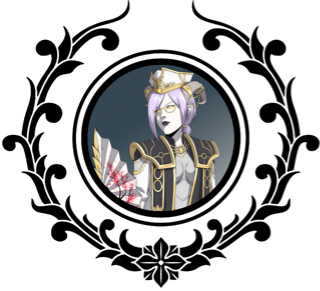


  
  <h1 style="text-align: center;">About the Code Goat</h1>


Hello there! I'm Volteal, also known as Luna C. Crescent or the Code Goat to some people, a 33 year old transgirl programmer and gamer from the Netherlands. I am the God-Queen of Skill issues. I  have been programming for about 8 years now. I started once upon a time working in PHP but I have moved on to greener pastures and now write semi-passable Go code. I only started working with Go a few months back (in April 2024) and I have been enjoying the learning proccess immensely.

The project I took on to learn is [The Azure Archives](/TheCodeGoatDen/projects/the-azure-archives) which is a community website for World of Warcraft roleplayers where they can post their character, guild, community profiles along side stories, art, and they can advertise their in game events!

Now, Looking at my alias you might be asking yourself "why refer to yourself as a Code Goat in your nickname?" Well, honestly I really like the song Code Monkey by Jonathan Coulton and I play a Draenei in World of Warcraft who are often refered to by the community as Space Goats because they have horns and goat like legs. So I combined the two when making my twitch account and boom here we are!


  <h1 style="text-align: center;">My Hobbies</h1>


## Coding
Placeholder

## TTRPGs
Placeholder

## MMOs
Placeholder